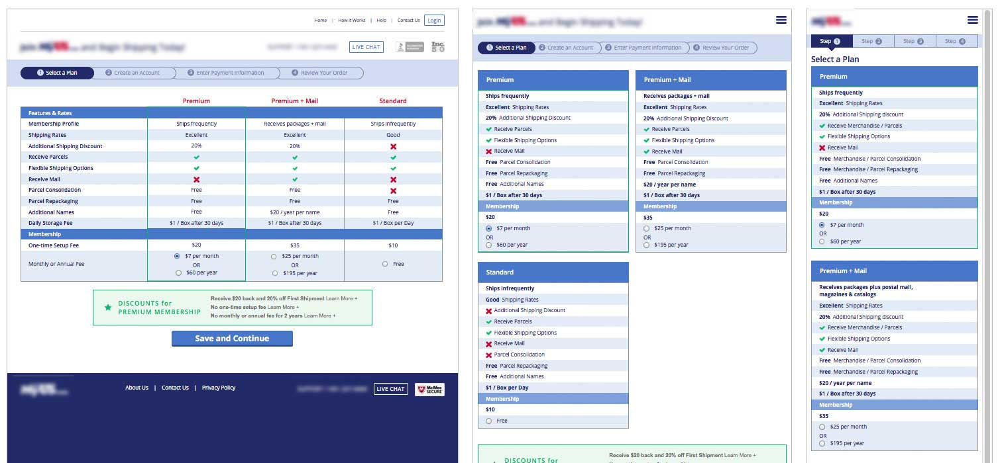

# RWD Viewer

## Purpose
I needed a simple way to view the same page at multiple media queries as I was developing a responsive website.

I wrote this simple viewer which shows the page at three prefefined widths by default. Works best on a cinema display, and I recommend using LiveReload.

## Usage

Open in your browser of choice with your page to test (local or remote) specified as the page URL parameter, e.g.

	rwdviewer/index.html?page=http://elevatorup.com/
	
Alternatively, you can set up a bookmarklet that will allow you to view a page in RWD Viewer by clicking on the bookmark. Create a bookmark in your web browser with the following link (edited to reflect your installation of RWD Viewer):

	javascript:location.href='http://yourdomain.com/rwdviewer/?page='+location.href;

## Example
	

*Also pretty sweet for taking screenshots of multiple media queries*
